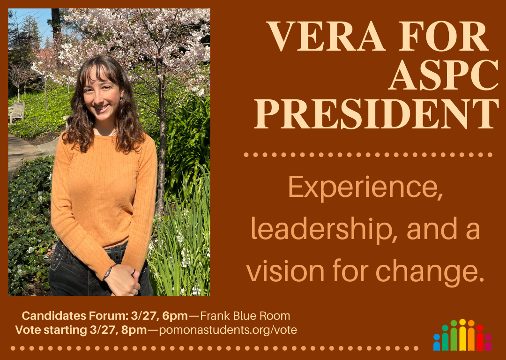
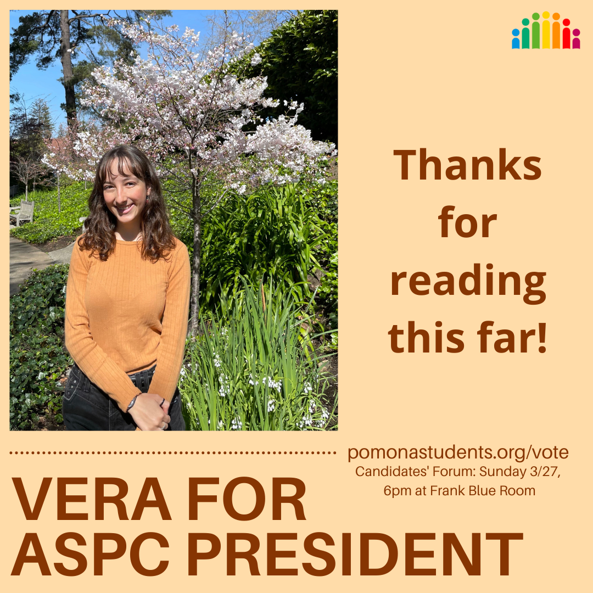

---
title: PLATFORM
layout: template
filename: index
meta name: xEnUk2V2-XtOhcEGf99du7CBnP7cdAhW6ldh47R87dc
--- 

 

# Vote for Vera!

Join my [Facebook Group](https://www.facebook.com/groups/654089445849890) and follow me on Instagram at [@vera4aspc](https://www.instagram.com/vera4aspc/)

Vote at [pomonastudents.org/vote](https://pomonastudents.org/vote) starting Sunday, March 27 at 8pm

# Overview

Hi everyone! My name is Vera Berger and I’m running to be your next ASPC President. My platform is grounded in experience, leadership, and a vision for change.

I see senate in its potential to uplift students financially and in advocacy—it’s important to remember that ASPC is both a nonprofit operating independently of the College and an organization with power to make institutional change. We can provide student clubs, mentor groups, and projects with ASPC funding, and represent student voices with administrators. Through conversations with fellow members of ASPC, head mentors, peers, and administrators, I’ve developed a platform for the presidency that is ambitious, dynamic and actionable. My five main goals are as follows.

1. [Promote Student Leadership and Involvement in Institutional Processes](#goal1)
2. [Advance Physical, Social, and Emotional Wellness Through Individual- and Community-Focused Initiatives](#goal2)
3. [Foster Equity and Inclusion in Academics](#goal3)
4. [Center Students Through ASPC Initiatives](#goal4)
5. [Accelerate Pomona’s and ASPC’s Carbon Neutrality Efforts](#goal5)

Having been an ASPC senator, sponsor, mentor, and JBoard chair, I understand student struggle with administration. In my time at Pomona, I’ve worked to represent students in 5+ administrative committees, increase access to resources like period products and water refill stations, and create equitable college policy. **I have the experience to lead ASPC smoothly and to understand what needs to change.**

Please reach out to me at (505)227-4516 or [vlba2019@mymail.pomona.edu](mailto:vlba2019@mymail.pomona.edu?subject=[ASPC]) with any questions, suggestions, or concerns! I hope to have your support. 

Vera

# Platform

##  Promote Student Leadership and Involvement in Institutional Processes

### Fund mentor groups, regardless of department or student-led status, because mentor groups should not have to choose between institutional support and autonomy. 

+ Utilize interest from ASPC’s endowment to provide mentor groups with programming funding, and ensure those groups maintain their $4500 annual programming budget (rather than $1000 or $3450 as student- or department-led groups as of next school year)
+ Allocate additional funds by request proportional to mentor groups’ number of mentees
+ Work with Student Affairs to ensure department-led mentor groups are overseen by culturally competent administrators

### Involve and embed students in institutional processes and compensate them for their work.
+ Increase student involvement in hiring and review processes for staff and faculty, and involve students that are not in ASPC in hiring committees
+ Compensate students who participate in the hiring or review process
+ Increase weekly hours limit for student workers to pre-pandemic allotment of 20 hr/week
+ Advocate for on-campus jobs to be stipend-based for student workers that cannot get a social security number
 
## Advance Physical, Social, and Emotional Wellness through Individual- and Community-focused Initiatives

### Physical and mental health
+ Collaborate with TCCS and Comm. of Wellness to reopen the Health Education Outreach (HEO) office 
  + Until school went remote, the center provided a relaxation room, wellness garden, safe sex supples, pregnancy testing and counseling, alcohol and marijuana education, and more
+ Work with admin to provide more Pomona-specific mental and physical health resources
  + Many of us have experienced the multi-week wait times at MCAPS and SHS. Hiring more therapists, psychiatrists, physicians, and nurse practitioners is a long-term goal and a 5C-wide initiative. In the meantime, I will work with the Dean of Students to look into hiring staff with drop-in hours for students
+ Hire Pomona-specific contact tracers, if COVID testing continues to be a requirement

### Residential life and dining
+ Compel HRL to bring back live-in sponsors and to compensate them—having been a sponsor, I understand the time and care required to build community with first-years
+ Incentivize writing room reviews on the ASPC website with Coop gift cards annually
  + Work with the ASPC Software Development Group to enable students to post pictures of residence hall rooms in reviews
+ Accommodate for students with diverse dietary needs through ASPC Food Committee
+ Bring back snack culture!

### Rains Center for Athletics, Recreation, and Wellness
+ Ensure the Center is ready for use prior to pre-season
+ Work with Comm. of Athletics to implement a feedback system for the first two months after opening
+ Work with Comm. of Wellness to build wellness spaces and programming, and establish an ASPC-led womxn workout hours
+ Ensure there are abundant student jobs associated with Rains, and work with the CDO to ensure jobs are properly advertised on Handshake

### Athletics
+ Advocate for more nourishing pre-game meals at Frary with the ASPC Food Committee
+ Stream Pomona-Pitzer athletics games at the Coop Fountain

### COVID
+ Work with the COVID-19 Planning and Response Group to dissolve the COVID Policy Committee responsible for evaluating COVID policy violations
  + Send these cases instead to JBoard, which has standardized procedures, students trained to evaluate cases, and an established appeals process
+ Work with the Comm. of Campus Events to plan and hold safe 5C events

## Foster Equity and Inclusion in Academics
+ Put a referendum for the student body on the Fall ASPC ballot on implementing shadow grading for first-semester freshmen—students voted to establish shadow grading in 2020, but no steps have been made since. If students are still interested, ASPC will present the case to the faculty Curriculum Committee
+ Extend ASPC's promise to work with immunocompromised students individually, and work with Comm. of Facilities and Environment to better equip classrooms with hybrid learning capabilities such as video/audio systems and tracking cameras
+ Continue student initiatives to make lab courses count for credit in conversations with the Dean of the College
+ Develop criteria and resources for professors to cultivate inclusive learning environments—Pomona has an “inclusive teaching requirement” for faculty, but currently gives no specific criteria and has no way to evaluate tenured professors
+ Work with STEM departments to revisit weeder classes and develop more accessible introductory coursework
+ Work with the incoming Dean of the College to maintain transparency about decisions made by the faculty (e.g. the decision not to require hybrid learning options for immunocompromised students)
+ Get a student representative on the Academic Standards Committee charged with reviewing the academic standing of students
+ Work with Registrar to include a label on the course registration portal for professors that offer hybrid learning options

## Center Students Through ASPC Initiatives

### Redirect Funds to Students
+ Since ASPC transferred ownership of the Coop Fountain to the College, we have significant funds to redirect to students.
Reinstate the Senate Grant Project: allow students to apply for Senate grants to pursue campus-applied research or wide-scaled events (art walks, carnival, etc.) 
+ Expand the rideshare program, create a platform on the ASPC website for students looking to share rides to airports to connect
+ Finance subscriptions beyond the New York Times based on a student opinion survey (in case you didn’t know, ASPC subscribes to NYT on your behalf, and you can make an account if you haven’t already!)
+ Increase funding for Class Presidents to allow for events like the senior Vegas trip, and to make up for events that juniors and seniors missed due to remote learning

### Increase Transparency 
+ Publish a quarterly ASPC report and senator project tracker 
+ Advertise open senate meetings to the student body

### Resurface long-term initiatives
+ Plan an antiracism training for ASPC senators alongside the VP Student Affairs and Comm. of Equity and Inclusion
+ Revive the Coop committee to oversee the Coop Store and Fountain, centralize marketing and social media efforts
+ Establish stipends for PEC committee members

### Revise Policy
+ Revisit the ASPC Constitution (this is long overdue)
+ Refine the structure of committees chaired by senators to ensure more support and communication with relevant divisions of the College and ASPC Executive Council 

## Accelerate Pomona’s and ASPC’s Carbon Neutrality Efforts

Pomona is behind on its goal to be carbon neutral by 2030. As President, I will push the College to divest from fossil fuels responsibly and counteract remaining emissions with a carbon fee and investment in sustainability-minded projects.

### ASPC 
+ Work with Comm. of Facilities and Environment to conduct in-depth analysis of ASPC-associated emissions and develop a plan to become carbon neutral
+ Hold zero-waste events in collaboration with PEC and the Sustainability Office

### Pomona

Divest from fossil fuels responsibly
+ Publish the percentage of Pomona’s endowment invested in fossil fuels
+ Push for Environmental, Social and Governance in Pomona’s investment policy for its endowment—criteria for Pomona to invest in companies that are sustainable or socially conscious
+ Advocate for a carbon fee on departments for heat- and electricity-associated emissions; use funds gathered from the fee to finance campus sustainability projects

### Student leadership
+ Work to get a second student representative on the Board of Trustees Facilities and Environment Committee
+ Provide ASPC-funded stipends to student representatives on the President’s Advisory Committee on Sustainability

 

